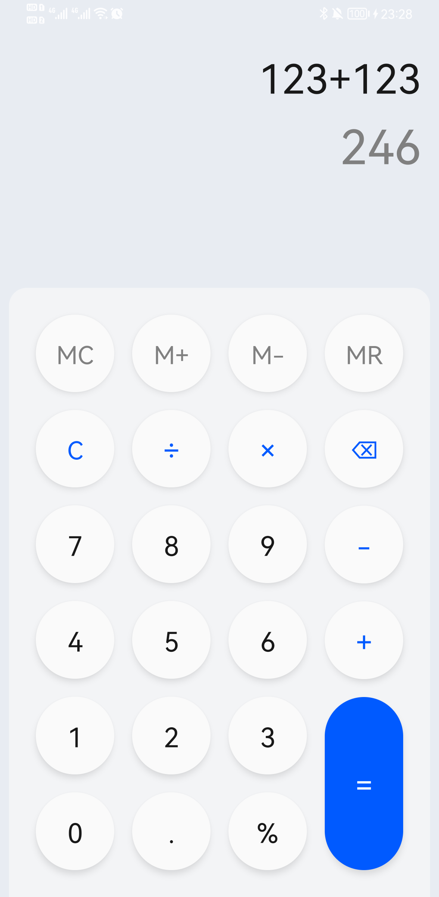
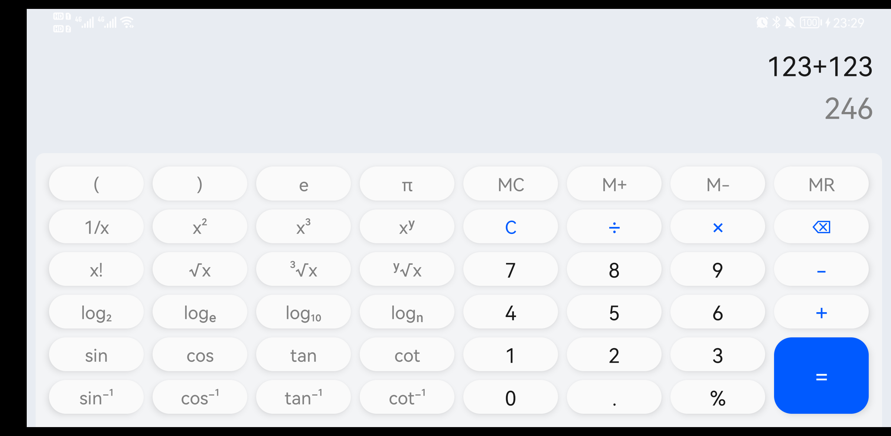
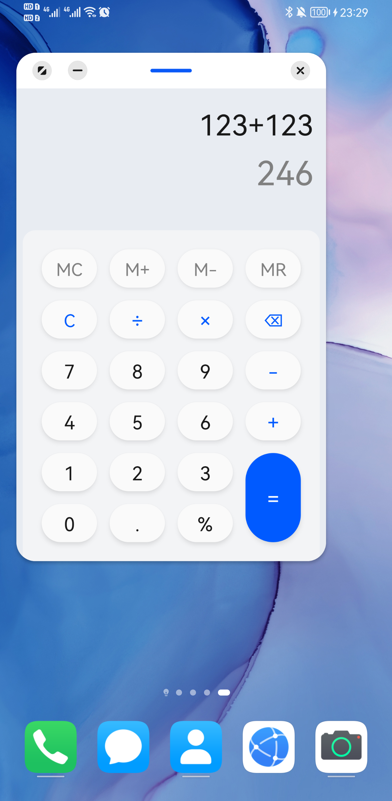
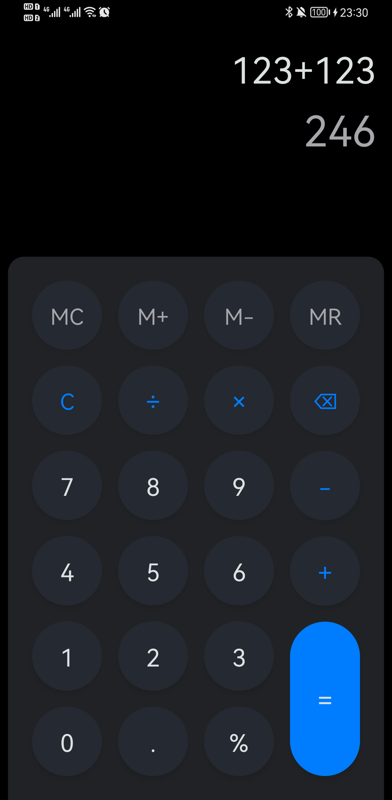
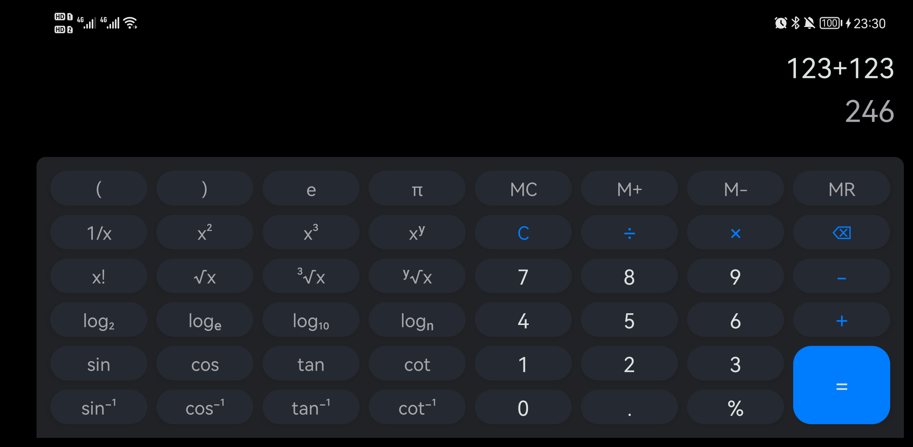
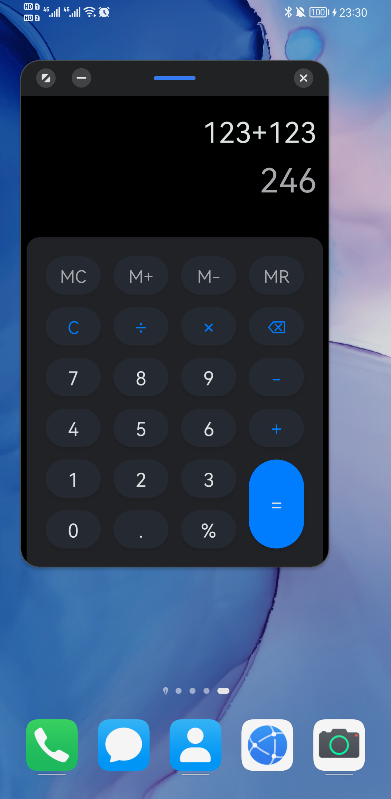
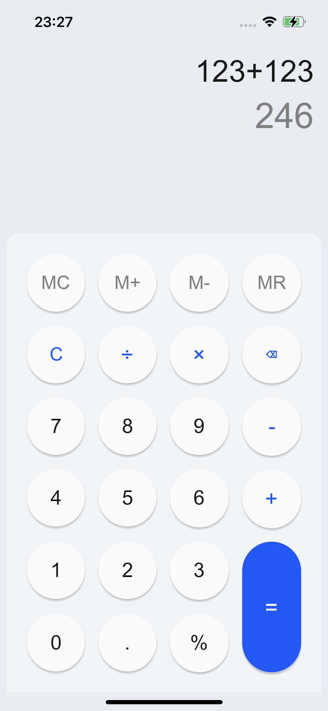

## 2022 Compose 进阶挑战作品

### 效果展示

#### Android

#### iOS

### 设计思路

1. 通过在 KMM 项目中接入跨平台的 Compose-jb 项目，实现双端开发。
2. 在 Android 中直接使用 Compose 函数，在 iOS 中先将 Compose 函数封装成 UIViewController 再通过 SwiftUI 接入 UIViewController。（也可以不用 SwiftUI 直接接入）
3. 封装 `LocalWindowInsets` `LocalOrientation` 自动感知状态栏导航栏和手机屏幕方向的变化。
4. 封装 `Modifier.coerceInWidth()` 自定义方法，实现将高度限制在宽度范围内（高度≤宽度），实现竖屏时候按钮最多会变成圆形，而不是变得更高。同时在小窗模式因为高度不足，按钮会自动压低，自动适配屏幕。
5. 通过编译原理的思想，先通过词法分析找出`Token`，再通过语法分析构建抽象语法树。（这部分还未实现）

### 说明

1. 因为时间关系，UI部分完成了，逻辑部分暂时还未完成。
2. 参加该项目的主要目的是为了推广`Compose`跨端开发，希望更多的人能知道`Compose`也可以做跨端（Android/iOS），虽然iOS端还非常不成熟，但是希望更多人可以加入建设，或者给官方看到，可以加快支持。